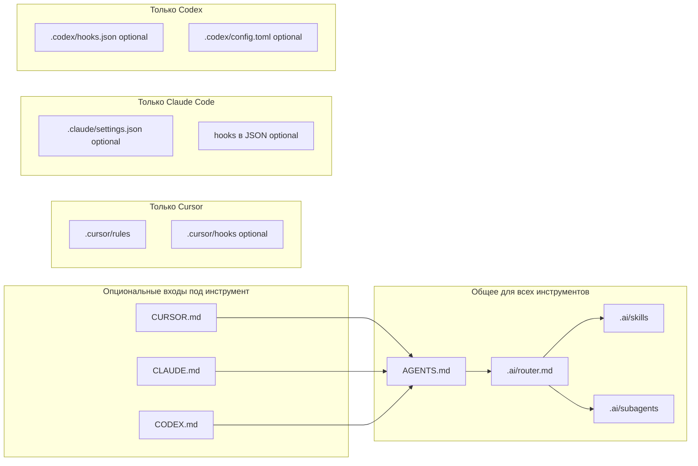

# Стандартизация AI для .NET (C#) и Angular

Документ перенесён из плана Cursor в репозиторий. Оперативные инструкции агента: [AGENTS.md](../../AGENTS.md), [.ai/router.md](../../.ai/router.md), [каталог артефактов](../../.ai/catalog.md). Политика данных: [security_sdlc.md](../../.ai/policies/security_sdlc.md). Матрица вендоров: [multi_vendor_tool_matrix.md](../../.ai/multi_vendor_tool_matrix.md).

**Примечание:** раздел «Замечание по текущему репо» в исходном плане устарел: `research.md` удалён, используется `research_competitors.md`, router синхронизирован.

---

# План: стандартизация AI для .NET (C#) и Angular

## Короткий ответ про «стандартные списки»

**Единого официального «списка скилов для всех команд» от Cursor нет.** Есть:

- **Документация и примеры** Cursor: [Rules](https://cursor.com/docs/context/rules), [Agent Skills](https://cursor.com/docs/context/skills) (файлы `SKILL.md` + frontmatter), [Hooks](https://cursor.com/docs/agent/hooks), [Subagents](https://cursor.com/docs/context/subagents) — это *типы артефактов* и контракты, а не готовый набор для .NET/Angular.
- **Шаблоны сообщества** (репозитории с наборами skills/rules) — полезны как старт, но их нужно **верифицировать** под ваш стек, линтеры, безопасность и процессы.
- **Ваш репозиторий** уже задаёт протокол: [AGENTS.md](../../AGENTS.md), [`.ai/router.md`](../../.ai/router.md), локальные skills в [`.ai/skills/`](../../.ai/skills) и subagents в [`.ai/subagents/`](../../.ai/subagents) — это правильное направление: **один router + ограниченный набор skills + роли subagents**.

Итого: «стандарт» = **ваш внутренний каталог** (skills / rules / subagents / hooks) + **политики** (когда что вызывать, какие данные нельзя отдавать модели).

---

## Мультивендор: Cursor, Claude, Codex (и смежное)

Цель — не привязать стандарт команды к одному IDE: **часть артефактов переносима между продуктами**, часть — нет; это нужно явно разделить.

### Что переносимо (держать в git, без привязки к вендору)

- Текстовые **playbooks**: цели, чеклисты, формат ответа, DoD, security gates — те же `.ai/skills/*.md`, `AGENTS.md`, ADR, шаблоны PR.
- **Стандарты кода** как обычные правила репозитория (EditorConfig, analyzers, ESLint/Prettier для Angular) — агент любого вендора их может соблюдать, если вы их подключаете в промпт или в контекст.

### Что не переносимо (документировать отдельно по продукту)

- **Cursor**: Rules (`.mdc`), Agent Skills (`SKILL.md` + frontmatter), Subagents, Hooks — формат и события специфичны для Cursor.
- **Claude (Anthropic)**: веб/API/Team-проекты vs **Claude Code** (CLI-агент в репо) — у CLI свой набор конфигов и соглашений по локальным инструкциям в репозитории (аналог «всегда читай X»); хуки Cursor сюда не переносятся.
- **Codex (OpenAI)** / экосистема **GitHub Copilot** (в т.ч. агентные сценарии в IDE и на GitHub): другие границы песочницы, другая модель сессии и политики хранения контекста — ваши markdown-skills остаются источником правды, а «как запускать» фиксируется в runbook.

### Практическая стратегия для .NET + Angular

1. **Один канонический текстовый каталог** в монорепо/орг-репо: router + skills + глоссарий (уже близко к [`.ai/router.md`](../../.ai/router.md) и [`.ai/skills/`](../../.ai/skills)).
2. **Матрица «класс задачи → инструмент»**: например быстрый inline в Cursor; длинная автономная сессия в Claude Code или Codex CLI; ревью PR — Copilot/GitHub или отдельный skill в любом клиенте.
3. **Единая политика данных** для всех вендоров (PII, секреты, customer data) — не дублировать ослабленные правила под «удобный» клиент.
4. **Юридический/закупочный слой**: enterprise-контракты, регион обработки данных, opt-out обучения — завести таблицу по каждому поставщику и привязать к допустимым сценариям.

### Ожидания без иллюзий

- **Нет общего стандарта именования** «skill» между Cursor / Claude / Copilot — это разные продукты; вы стандартизируете **содержание** (markdown + чеклисты), а оболочку подстраиваете под документацию каждого инструмента на момент внедрения.

---

## Направления стандартизации (что покрыть командам)

Ниже — независимые «оси», по которым имеет смысл строить программу. Для backend и frontend часть осей общая, часть — специфична.

### 1) Управление и владение артефактами

- Владелец каталога skills/rules (архитектор / tech lead / platform).
- Версионирование и ревью изменений в `.cursor/`, `.ai/`, `AGENTS.md` так же, как в коде.
- Единый **глоссарий** (feature, slice, PR, DoD, AC) в router/skills.

### 2) Маршрутизация запросов к агенту (как у вас в router)

- Один входной протокол: классификация задачи → **ровно один** skill (как в [`.ai/router.md`](../../.ai/router.md)).
- Явные **Output format** и **Quality bar** в каждом skill (у вас уже заложено в router).

### 3) Rules (постоянный контекст и «негласные законы» репо)

- Проектные: стиль C#, nullable, analyzers, структура bounded context, порты, **модульные тесты: xUnit + Moq** (политика ниже; устаревшие упоминания NUnit в правилах команды заменить на xUnit при внедрении).
- Angular: стиль компонентов, OnPush где принято, signals/standalone, лимиты на `any`, подход к формам и HTTP-слою.
- Разделение: **глобальные** правила vs **path-scoped** (только `*.cs`, только `*.ts`).

### 4) Skills (процедуры под типовые задачи)

**Общие для обеих команд:** code review, мелкий рефакторинг, написание ADR, подготовка PR-описания, разбор CI, security checklist (секреты, PII), onboarding «как попросить агента».

**.NET-специфика:** новый endpoint/handler, миграции и слой infrastructure, FluentValidation/MediatR-паттерны (если у вас так принято), `dotnet format`/анализаторы, производительность и логирование, **генерация/ревью модульных тестов по skill `dotnet_unit_tests_xunit_moq`**, **аудит репозиториев по skill `repository_layer_audit`**.

**Angular-специфика:** новый feature-module/slice, компонент только презентационный, работа с RxJS/signals, lazy routes, a11y/i18n, стратегия тестов (Jest/Karma — что у вас).

### 5) Subagents (роли, не дублируя skills)

Типовой набор ролей (пример, не «стандарт от Cursor»):

- **Planner** — декомпозиция, риски, зависимости ([`.ai/subagents/planner.md`](../../.ai/subagents/planner.md)).
- **Reviewer** — вторая голова на дифф ([`.ai/subagents/reviewer.md`](../../.ai/subagents/reviewer.md)).
- **Tester** — сценарии ручной проверки / e2e (если skill на Playwright уже есть — не плодить дубли).
- **Release/CI** — интерпретация логов пайплайна (опционально).

Правило: **subagent = роль и границы**, **skill = процедура и формат результата**.

### 6) Hooks (автоматизация вокруг агента)

Форматы **разные по продукту** (на схеме «практичный минимум» три блока): **Cursor** — `.cursor/hooks/` и документация Cursor Hooks; **Claude Code** — блок `hooks` в **`.claude/settings.json`**; **Codex** — **`.codex/hooks.json`** / секции в **`.codex/config.toml`**. **Ни один из этих hooks не проходит через `.ai/router.md`** — router относится только к markdown-skills; hooks — событийный слой клиента. Общая политика команды (allowlist команд, таймауты, guard на секреты) — в skills/ADR; реализация — в конфиге выбранного клиента.

Типовые сценарии: линт/format на затронутых файлах; предупреждение при касании секретов или `.env`; лёгкая телеметрия без содержимого кода.

Риск: hooks легко сделать «шумными» — нужен **лимит времени** и чёткий allowlist команд.

#### Примеры hooks (иллюстрация)

Ниже — **минимальные** заготовки; полные схемы полей и событий — в документации клиента.

**Cursor** — `hooks.json` в проекте (см. [Hooks](https://cursor.com/docs/hooks)):

```json
{
  "version": 1,
  "hooks": {
    "afterFileEdit": [{ "command": ".cursor/hooks/format-on-edit.sh" }]
  }
}
```

**Claude Code** — фрагмент **`.claude/settings.json`** (официальный паттерн `PreToolUse` + `matcher` + вложенный массив `hooks`, см. [Hooks reference](https://code.claude.com/docs/en/hooks)):

```json
{
  "hooks": {
    "PreToolUse": [
      {
        "matcher": "Bash",
        "hooks": [
          {
            "type": "command",
            "if": "Bash(rm *)",
            "command": "${CLAUDE_PROJECT_DIR}/.claude/hooks/block-rm.sh",
            "args": []
          }
        ]
      }
    ]
  }
}
```

**Codex** — в **`config.toml`** нужен флаг **`codex_hooks`**; в **`.codex/hooks.json`** — три уровня: событие → группа `matcher` → обработчики (см. [Codex hooks](https://developers.openai.com/codex/hooks)):

```toml
[features]
codex_hooks = true
```

```json
{
  "hooks": {
    "PreToolUse": [
      {
        "matcher": "Bash",
        "hooks": [
          {
            "type": "command",
            "command": "/usr/bin/dotnet format whitespace --folder src --verify-no-changes",
            "timeout": 60,
            "statusMessage": "dotnet format check"
          }
        ]
      }
    ]
  }
}
```

### 7) Безопасность и комплаенс

- Политика данных: что нельзя вставлять в чат (клиентские данные, внутренние URL, ключи).
- Разграничение: локальные модели vs облако; логирование промптов.
- Supply chain: не подтягивать чужие skills/rules без ревью.

### 8) Качество и стоимость

- Лимиты на размер контекста (ссылки на файлы вместо вставки всего репо).
- Когда использовать «лёгкую» vs «тяжёлую» модель.
- Шаблоны промптов с обязательными полями: цель, ограничения, критерии готовности, файлы-якоря.

### 9) Интеграция в SDLC

- Definition of Ready / Done с пунктом «прогнали агентом по skill X».
- Шаблон PR: что агент должен был проверить (риски, тесты, breaking changes).
- Синхронизация с Jira/Confluence (если skill [jira_sprint_ac](../../.ai/router.md) планируется — в router указан файл, в репо может отсутствовать; стоит выровнять таблицу router с реальными файлами).

### 10) Обучение команды

- Короткий internal playbook: 1 страница «как начать сессию», 1 страница «как ревьюить вывод агента».
- Периодический разбор «плохих» ответов модели → обновление rules/skills.

### 11) Мультивендор-гайд (Cursor + Claude + Codex)

- Runbook: где какой клиент разрешён; как синхронизировать изменения в общих `.ai/skills` при обновлении vendor-specific конфигов.
- Ревью изменений в «опасных» местах: hooks, скрипты агента, allowlist команд.

---

## Сводка: хуки, MCP и триггеры (AI + MCP + GitLab + Jira + вики)

**Зачем раздел:** одним местом зафиксировать, **кто кого вызывает**, чтобы не путать **AI hooks** (клиент агента), **MCP servers** (tool providers для агента), **GitLab Webhooks** (HTTP с сервера GitLab) и **CI pipeline** (проверки после push/MR).

### AI hooks (локально / в сессии агента)

- **Cursor** — каталог **`.cursor/hooks/`** и конфигурация хуков Cursor в проекте (см. [Hooks](https://cursor.com/docs/agent/hooks)); **инициатор:** Cursor IDE; **когда:** события жизненного цикла агента/IDE (точный набор — в доке Cursor); **зачем:** политика до коммита (format/lint, guard на секреты, allowlist shell, таймауты). **GitLab сюда не шлёт HTTP сам по себе.**
- **Claude Code** — блок **`hooks`** в **`.claude/settings.json`** ([Hooks](https://code.claude.com/docs/en/hooks)); **инициатор:** Claude Code; **когда:** например `PreToolUse` и др. по схеме продукта; **зачем:** те же классы политик, формат — JSON внутри одного файла.
- **Codex** — **`.codex/hooks.json`** + **`config.toml`** с **`codex_hooks`** ([Codex hooks](https://developers.openai.com/codex/hooks)); **инициатор:** Codex CLI; **когда:** по матчерам/событиям конфига; **зачем:** CLI-обвязка проверок в стиле Codex.

**Папки/файлы разные** потому что это **разные продукты** с разными точками чтения конфига и **несовместимыми схемами**; переносится **смысл** политик (что проверять), а не копипаста одного JSON.

### MCP servers (tool providers для агента)

- **Инициатор:** AI agent / IDE.
- **Куда:** локальный или удалённый MCP server.
- **Когда:** когда агенту нужен внешний инструмент или доступ к данным.
- **Зачем:** браузер, Jira, GitLab, документация, wiki, внутренние API, БД или другие интеграции.
- **Ключевое отличие:** MCP server не запускается сам от `push`/MR и не является GitLab webhook. Его вызывает агент или отдельная автоматизация, которой явно дали такой шаг.

```text
AI Agent / IDE
  -> reads AGENTS.md / router.md / skills
  -> runs AI hooks on lifecycle events
  -> calls MCP servers as tools when needed
  -> edits code / runs shell / opens browser

GitLab
  -> webhooks to backend / worker / bot
  -> CI pipelines on push/MR
```

### GitLab Webhooks (сервер → ваш URL)

- **Инициатор:** GitLab.
- **Куда:** зарегистрированный **HTTPS endpoint** вашего сервиса.
- **Когда:** по выбранным событиям (push, MR opened/updated, pipeline finished, merge и т.д.).
- **Зачем:** оркестрация вне агента — уведомления, worker, постановка задач, связка с Jira/ботом комментариев в MR.

### GitLab CI (не HTTP-webhook AI, но «крючок процесса» качества)

- **Pipeline на push** — после `git push` в ветку: style (`dotnet format --verify-no-changes`), анализаторы, юнит-тесты; быстрый отказ до MR.
- **Pipeline на MR** (часто `merge_request_event`) — в MR в целевую ветку (`dev`): критические проверки, артефакты; **required check** / approval rules для merge.

### Опционально: серверные git hooks в GitLab

- Кастомные **pre-receive / update / post-receive** на стороне Git (если политика организации требует); чаще достаточно **CI + protected branches** без усложнения поддержки.

### Связка с Jira и MR (процесс, не AI-hook)

- **Push в feature-ветку:** фидбек по code style и тестам — прежде всего **CI**; AI hooks — **до push** у разработчика.
- **MR в `dev`:** критические проверки — **CI**; комментарии в MR — **человек** и/или **бот** через **GitLab API**; перевод тикета «назад разработчику» — **Jira Automation** и/или вызов Jira REST из **CI `after_script` / отдельного job** / **обработчика GitLab webhook** при failed pipeline или label `needs-fix` (единый источник правды, чтобы не было гонки правил).

### Вики (не хук; документирование изменений процесса)

- Страница runbook: **версия процесса**, **дельта** к прошлой версии, **область действия**, ссылки на MR с изменениями `.gitlab-ci.yml`, шаблонов MR, правил protected branches, политики AI.
- **Jira** — статус и обсуждение по тикету; **MR** — дифф; **вики** — норматив и история изменений процесса.

---

## Рекомендуемая структура «каталога» (практичный минимум)



**Зачем нет стрелки от `router` к `.cursor/rules` / hooks:** `.ai/router.md` выбирает только **skills** из `.ai/skills/`; **`.cursor/rules` и `.cursor/hooks` подхватывает IDE Cursor сама**, это не следующий шаг после router и не дочерний узел в пайплайне. На схеме колонка **«Только Cursor»** стоит рядом с каноном **только для наглядности** (отдельная зона артефактов), **без** связи от `router` — чтобы не выглядело как «роутер управляет правилами».

**Как читать схему:** **слева направо** пять **отдельных колонок** (subgraph) — входы → общий канон → три клиентских блока. Колонки **не смешивают** файлы на диске; это только расклад на чертеже. Внутри **Только Cursor**, **Только Claude Code** и **Только Codex** узлы **один под другим** (`direction TB`) — без лишней вложенной рамки «папка»; у Claude второй узел — **блок `hooks` внутри того же `settings.json`**, не отдельный файл. **Хуки:** **Cursor** — **`.cursor/hooks/`**; **Claude Code** — **`hooks`** в **`.claude/settings.json`** ([hooks](https://code.claude.com/docs/en/hooks)); **Codex** — **`.codex/hooks.json`** / **`config.toml`** ([Codex hooks](https://developers.openai.com/codex/hooks)). **Router** обслуживает только **skills** и subagents; **hooks и rules Cursor router не вызывают** — их подмешивает среда при открытии проекта в Cursor.

**Сводка по путям:** **Общие:** `AGENTS.md`, `.ai/router.md`, `.ai/skills/`, `.ai/subagents/`. **Только Cursor:** `.cursor/rules/`, `.cursor/hooks/`, опционально `.cursor/skills/`, `.cursor/AGENTS.md`. **Только Claude Code:** `.claude/settings.json` (в т.ч. блок **`hooks`** в этом же файле). **Только Codex:** `.codex/hooks.json`, `.codex/config.toml` (и флаг `codex_hooks` в конфиге по документации). **Входы-файлы:** `CURSOR.md`, `CLAUDE.md`, **`CODEX.md`** (альтернатива — `docs/ai/CODEX.md`).

- **Один** `AGENTS.md` в репозитории — общий протокол для всех инструментов (центральный блок на схеме).
- **`CURSOR.md`** — опционально; дублировать смысл с **`.cursor/AGENTS.md`** не обязательно — выберите один второй вход для команды.
- **`CLAUDE.md`** — опционально.
- **`CODEX.md`** в репозитории — опционально, только Codex / CLI; альтернатива — **`docs/ai/CODEX.md`**; либо достаточно одного **`AGENTS.md`**.
- **Router** держит таблицу skill ↔ триггеры; skills не пересекаются по смыслу.

**Актуальность относительно последних правок:** блок выше — **концептуальный минимум** (поток контекста и роли артефактов); он **не противоречит** мультивендору и политике xUnit/Moq. Детальное **дерево каталогов** (входы для Claude/Codex, опциональные `.cursor/skills`, отдельные skills для тестов и аудита репозитория) — в разделе «Пример структуры файлов (канон + Cursor / Claude / Codex)» **ниже по документу** (после блока про xUnit/Moq).

---

## .NET: политика модульных тестов (xUnit + Moq)

Норматив для агентов и ревью (вынести в отдельный skill + rule на `**/Tests/**/*.cs` или ваш каталог тестов):

- **Фреймворк**: xUnit; **изоляция**: Moq для зависимостей; интеграционные тесты с реальной БД — **отдельный** тип задачи и отдельный skill/проект, не смешивать с модульными.
- **Параметризация**: по возможности `[Theory]` + `[InlineData]` / `[MemberData]` / custom `IXunitSerializable` — в названии теста или в `DisplayName`/`[Trait]` кратко фиксировать **какое состояние входа** проверяется.
- **Покрытие состояний**: для каждого входного параметра перечислить **допустимые классы эквивалентности** (null/пустая строка/граница диапазона/типичное/невалидный формат и т.д. — по контракту метода); если вариантов много — `MemberData` из статического провайдера, а не десятки копий одного теста.
- **Доступ к данным**: в модульных тестах **мокать** интерфейсы репозиториев / `DbContext` factory / unit-of-work — то, что отвечает за доступ к БД; не поднимать Testcontainers внутри «модульного» skill без явного запроса.
- **Аудит репозитория**: при работе с классом `*Repository*` агент обязан (1) проверить отсутствие бизнес-правил, ветвлений по доменным смыслам, композиции юз-кейсов; (2) при нахождении — **явная секция «Рефакторинг»**: что вынести (доменный сервис, application handler, domain service, specification), пример сигнатур, минимальный план миграции. Это отдельный skill, подключаемый из router для задач «тесты + репозиторий».

---

## Пример структуры файлов (канон + Cursor / Claude / Codex)

Принцип: **один канонический текст** в `.ai/`; вендоры получают тонкие «входные» файлы, которые не дублируют логику, а указывают на протокол.

**Порядок секций ниже совпадает с колонками на схеме «практичный минимум»** (слева направо): опциональные входы → общее для всех → только Cursor → только Claude Code → только Codex → альтернатива входа Codex. На диске папки могут сосуществовать в любом порядке; **логическая группировка** — как на диаграмме.

```text
repo-root/
  # --- 1. Опциональные входы под инструмент (колонка vendorOptional) ---
  CURSOR.md                          # optional: → AGENTS.md + .ai/router.md (или не создавать, если хватает .cursor/AGENTS.md)
  CLAUDE.md                          # optional: → AGENTS.md + .ai/router.md
  CODEX.md                           # optional: → AGENTS.md + .ai/router.md

  # --- 2. Общее для всех инструментов (колонка sharedAll) ---
  AGENTS.md
  .ai/
    router.md
    skills/
      engineering/code_review_before_push.md
      engineering/code_review_after_mr.md
      dotnet_unit_tests_xunit_moq.md
      repository_layer_audit.md
    subagents/
      planner.md
      reviewer.md

  # --- 3. Только Cursor (колонка cursorOnly) ---
  .cursor/
    rules/
      dotnet-testing.mdc
    hooks/                             # optional: скрипты / локальная обвязка (см. Cursor Hooks)
    AGENTS.md                          # optional: доп. инструкции (у вас в репо уже есть)
    skills/                            # optional: нативные Agent Skills (обёртки на .ai/skills)
      dotnet-unit-tests/
        SKILL.md

  # --- 4. Только Claude Code (колонка claudeOnly) ---
  .claude/
    settings.json                    # optional: конфиг проекта
    # hooks — блок внутри settings.json (не отдельный файл на диске)

  # --- 5. Только Codex (колонка codexOnly) ---
  .codex/
    hooks.json                       # optional
    config.toml                      # optional: [features] codex_hooks, [hooks], см. документацию Codex

  # --- Альтернатива входа Codex (вместо CODEX.md в корне) ---
  docs/
    ai/
      CODEX.md                       # optional: тот же смысл, что корневой CODEX.md
```

**Чеклист создаваемых каталогов** (пути в репозитории; **порядок пунктов** — как колонки на схеме):

- **Опционально (входы):** **`CURSOR.md`**, **`CLAUDE.md`**, **`CODEX.md`** (или только `AGENTS.md` + `.cursor/AGENTS.md` без дублирования).
- **Обязательные (общее):** **`AGENTS.md`**, **`.ai/`**, **`.ai/skills/`**, **`.ai/subagents/`**
- **Обязательные (Cursor):** **`.cursor/`**, **`.cursor/rules/`**
- **Опционально (Cursor):** **`.cursor/hooks/`**, **`.cursor/skills/`**, **`.cursor/AGENTS.md`**
- **Опционально (Claude Code):** **`.claude/`** (в т.ч. `settings.json` с блоком hooks).
- **Опционально (Codex):** **`.codex/`** (`hooks.json`, `config.toml` по документации); **альтернатива входу** — **`docs/ai/CODEX.md`** вместо корневого **`CODEX.md`**.

**Корневые файлы по роли:**

- `AGENTS.md` — обязателен для протокола «router → один route: skill или subagent».
- `CURSOR.md` — опционально (симметрия с `CLAUDE.md`); не обязателен, если команда опирается на **`.cursor/AGENTS.md`**.
- `CLAUDE.md` — опционально (Claude Code).
- `CODEX.md` — опционально (Codex); равносильно по смыслу `docs/ai/CODEX.md`; можно обойтись только `AGENTS.md`.

Заметки по инструментам:

- **Cursor**: **`AGENTS.md`** + **`.cursor/rules`**, опционально **`.cursor/AGENTS.md`** и/или **`CURSOR.md`** (одинаковая роль: не дублировать длинные тексты — ссылка на `.ai/router.md`); опционально `.cursor/skills/*/SKILL.md` и `.cursor/hooks/`; **источник правды** по сценариям — `.ai/router.md`, `.ai/skills/*.md` и `.ai/subagents/*.md`.
- **Claude Code**: `CLAUDE.md` + тот же `AGENTS.md`; hooks в **`.claude/settings.json`**; прочие файлы в **`.claude/`** — по [документации](https://code.claude.com/docs/en/claude-directory); не дублировать тексты skills/subagents — ссылки на `.ai/router.md`.
- **Codex / CLI-агент**: **`CODEX.md`** или **`docs/ai/CODEX.md`** (или только **`AGENTS.md`**); hooks — **`.codex/hooks.json`** / **`config.toml`** ([документация](https://developers.openai.com/codex/hooks)); в markdown-входе — отсылка к `.ai/router.md` и выбранному route.

---

## Реализация в репозитории (актуально)

Многие пункты исходного блока Deliverable уже в git: [.ai/catalog.md](../../.ai/catalog.md), [.ai/multi_vendor_tool_matrix.md](../../.ai/multi_vendor_tool_matrix.md), [.ai/policies/security_sdlc.md](../../.ai/policies/security_sdlc.md), [.github/pull_request_template.md](../../.github/pull_request_template.md), [.cursor/hooks.json](../../.cursor/hooks.json), корневые [CURSOR.md](../../CURSOR.md), [CLAUDE.md](../../CLAUDE.md), [CODEX.md](../../CODEX.md).

### Исходный чеклист Deliverable (архив)

1. **Каталог направлений** — блоки 1–11 выше (оси стандартизации, включая мультивендор).
2. **Ответ про «стандартные списки»** — их нет как единого официального набора; есть типы артефактов Cursor + ваш корпоративный минимальный набор; для Claude/Codex — те же **содержимые** playbooks в git, разная **обвязка** у каждого продукта.
3. **Стартовый набор skills (пример состава, не канон)**  
   - `code_review`, `ci_failure_triage`, `feature_implementation_dotnet`, `feature_implementation_angular`, `security_prompt_check`, `adr_authoring`, `onboarding_repo`, **`dotnet_unit_tests_xunit_moq`**, **`repository_layer_audit`** — имена и границы согласовать с командами; последние два отражают вашу политику тестов и чистоты слоя данных.
4. **Матрица hooks и конфигов** — [.ai/multi_vendor_tool_matrix.md](../../.ai/multi_vendor_tool_matrix.md).
5. **Пример дерева каталогов** — раздел «Пример структуры файлов» выше в этом документе.
6. **Сводка хуков и триггеров** — раздел «Сводка: хуки и триггеры» выше в этом документе.

## Self-check

- [ ] Покрыты и процесс, и артефакты (rules/skills/subagents/hooks).
- [ ] Разделены общие оси и специфика .NET vs Angular.
- [ ] Явно сказано, что глобального «официального списка скилов» нет.
- [ ] Указана связка с уже существующими файлами репозитория (AGENTS, router, subagents).
- [ ] Отмечен риск рассинхронизации router ↔ фактические skills.
- [ ] Добавлены Claude и Codex: переносимый слой vs vendor-specific и ось 11 в направлениях.
- [ ] Пример дерева файлов и чеклист каталогов **согласованы** с порядком колонок на схеме (vendorOptional → sharedAll → cursorOnly → claudeOnly → codexOnly).
- [ ] Зафиксированы xUnit + Moq, Theory/данные, мок репозиториев, обязательный аудит BL в репозиториях с предложениями рефакторинга.
- [ ] На схеме минимума отражены входы Claude и Codex и перечислены все предлагаемые каталоги чеклистом.
- [ ] Зафиксирована сводка: AI hooks vs GitLab Webhooks vs CI vs связка MR/Jira; вики как слой документирования процесса (не хук).
